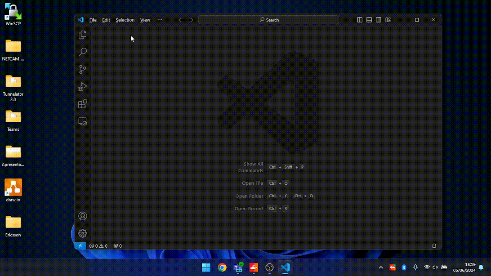

# Desafio Retirada de Equipamentos
### Requirements
- **VSCode** 
    - Instale o VSCode em https://code.visualstudio.com/download[this link].
    - Com o VSCode aberto, pressione `(Ctrl||Cmd) + Shift + X`, procure por `ms-vscode-remote.vscode-remote-extensionpac` e instale.
- **Docker:** Para instalar, siga estas etapas:
    - Windows https://docs.docker.com/desktop/install/windows-install/[guia de instalação].
    - Mac https://docs.docker.com/desktop/install/mac-install/[guia de instalação].
    - Linux https://docs.docker.com/desktop/install/linux-install/[guia de instalação].

### Etapas para Executar
#### 1. Abra a pasta raiz do projeto no VSCode

#### 3. Reabra o projeto no contêiner remoto
